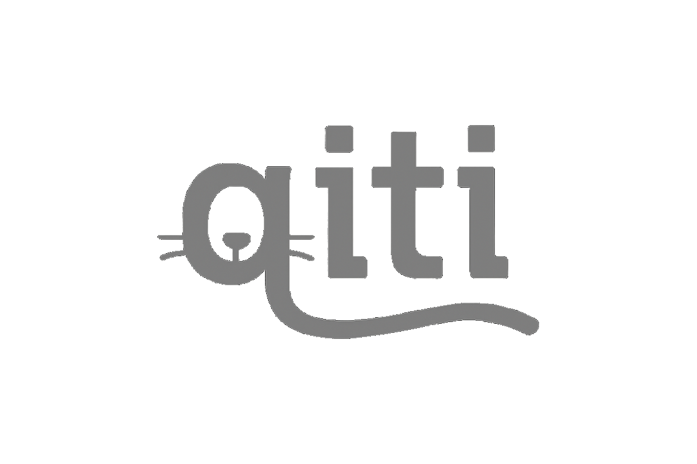

# qiti



Qiti is a lightweight C++20 library that brings profiling and instrumentation directly into your unit tests. 

By integrating seamlessly with your test framework of choice, Qiti lets you track custom metrics and gather performance insights without ever leaving your test suite.

Qiti also provides optional Thread Sanitizer wrapper functionality: when enabled, tests can be run in isolation under TSan, automatically detecting data races and other thread-safety issues. You can even enforce custom thread-safety behavior right from your test code, catching concurrency bugs early in CI.

## Requirements

- macOS (14 or 15, x86_64 and/or arm64)*
- Linux (tested on Ubuntu, Debian, and Fedora; x86_64)*  
- Windows (tested on Windows Latest with Clang; x86_64, ThreadSanitizer features not supported)*
- Clang or Apple Clang (additional compiler support TBD)*
- C++20
- CMake
- **macOS with ThreadSanitizer**: When building on macOS with `QITI_ENABLE_THREAD_SANITIZER=ON`, do not build universal binaries (arm64 + x86_64). ThreadSanitizer is incompatible with universal binaries. Build for your target architecture only.

## CMake Integration

Note: Qiti should not be linked in your final release builds. You will likely need to add a flag to your CMake invocation (e.g. -DQiti=1) to only link into your project when building your unit test executable, independent of your regular builds.

### ThreadSanitizer Support

ThreadSanitizer functionality is **optional** and disabled by default. To enable it, add `-DQITI_ENABLE_THREAD_SANITIZER=ON` to your CMake configuration:

```bash
cmake -B build . -DQITI_ENABLE_THREAD_SANITIZER=ON
```

When enabled, this adds ThreadSanitizer compiler flags (`-fsanitize=thread`, `-fno-inline`) and makes the `qiti::ThreadSanitizer` class available.

### Project Integration

To integrate Qiti into your CMake-based project, add Qiti as a subdirectory and link against the `qiti_lib` target provided by the library:

```cmake
# Add Qiti to your project
add_subdirectory(path/to/qiti)

# Create your unit test executable (e.g. Catch2)
add_executable(my_tests
    tests/test_my_component.cpp
    # etc.
)

# Link any intermediary libraries you build (and wish to profile/instrument) with qiti_lib
target_link_libraries(my_lib
    PRIVATE
        qiti_lib                # General Qiti library target
        Catch2::Catch2WithMain  # (or your chosen test framework)
        # etc.
)

# Link your final unit test executable with qiti_lib and qiti_tests_client
target_link_libraries(my_tests
    PRIVATE
        qiti_lib                # General Qiti library target
        qiti_tests_client       # Qiti target specific to final executable
        Catch2::Catch2WithMain  # (or your chosen test framework)
        # etc.
)
```

### CMake Settings

By linking against `qiti_lib`, Qiti automatically propagates:

- **Include directories**: `./include`
- **Core compiler flags** (via `INTERFACE`):
  - `-finstrument-functions`       (enable function instrumentation)
  - `-fno-omit-frame-pointer`     (preserve frame pointers)
  - `-g`                           (generate debug symbols)
- **ThreadSanitizer flags** (when `QITI_ENABLE_THREAD_SANITIZER=ON`):
  - `-fsanitize=thread`            (enable Thread Sanitizer)
  - `-fno-inline`                  (prevent inlining for TSan accuracy)
- **ThreadSanitizer linker flags** (when enabled):
  - `-fsanitize=thread`

You do not need to add these flags yourself—just ensure you are using Clang with C++20.

In addition, by linking your unit test executable with `qiti_tests_client`, Qiti automatically propagates:

- **Object File**: `./source/client/qiti_client_tsan_integration.cpp`
- **Linker flags** (via `INTERFACE`):
  - `-rdynamic`

## Manual Integration (Non-CMake Projects)

**⚠️ Note**: Manual integration is untested and you may experience issues. CMake integration is strongly recommended.

For projects not using CMake, you'll need to manually build the Qiti library and configure your build system:

#### Step 1: Build the Qiti Library

```bash
# Build qiti_lib shared library from all source/qiti_*.cpp files
clang++ -std=c++20 -shared -fPIC \
    -finstrument-functions -fno-omit-frame-pointer -g \
    -I./include -I./source \
    source/qiti_*.cpp \
    -o libqiti.so  # or .dylib on macOS
```

#### Step 2: Configure Your Test Executable Build

**Include in your project:**
- Add `source/client/qiti_client_tsan_integration.cpp` to your test executable's source files

**Required compiler flags:**
- `-std=c++20`
- `-finstrument-functions -fno-omit-frame-pointer -g`
- `-I./path/to/qiti/include` (for `qiti_include.hpp`)

**Required linker flags:**
- `-L./path/to/qiti -lqiti` (link the Qiti library)
- `-rdynamic`

**Optional ThreadSanitizer support:**
- Add `-fsanitize=thread -fno-inline -DQITI_ENABLE_THREAD_SANITIZER=1` to both compiler and linker flags

#### Requirements Summary:
- **Clang compiler** (Apple Clang or LLVM Clang)
- **C++20 standard**
- **Include qiti_client_tsan_integration.cpp** in your test executable
- **Link against libqiti** shared library
- **Apply required compiler/linker flags** above

For complex projects, consider using CMake's `FetchContent` to automatically handle Qiti integration.

## Deployment Target (macOS)

- When compiling on macOS, the deployment target must be 10.15 (Catalina) or later.

## *Platform & Compiler Test Matrix

Qiti is continuously tested across a comprehensive matrix of platforms, compilers, and configurations to ensure reliability and compatibility:

| Platform   | OS Version | Compiler                 | Build System | ThreadSanitizer | Test Frameworks |
|------------|------------|--------------------------|--------------|-----------------|-----------------|
| **macOS**  | 14         | Apple Clang (Xcode 15.4) | Xcode        | ✅ Enabled      | Catch2 + GTest  |
| **macOS**  | 15         | Apple Clang (Xcode 16.2) | Xcode        | ✅ Enabled      | Catch2 + GTest  |
| **macOS**  | 15         | LLVM Clang 16            | Ninja        | ✅ Enabled      | Catch2 + GTest  |
| **Ubuntu** | Latest     | LLVM Clang 16            | Ninja        | ✅ Enabled      | Catch2 + GTest  |
| **Ubuntu** | Latest     | LLVM Clang 16            | Ninja        | ❌ Disabled     | Catch2 + GTest  |
| **Debian** | Stable     | LLVM Clang 17            | Ninja        | ✅ Enabled      | Catch2 + GTest  |
| **Fedora** | Latest     | LLVM Clang (latest)      | Ninja        | ✅ Enabled      | Catch2 + GTest  |
| **Windows** | Latest     | LLVM Clang 16            | Ninja        | ❌ Disabled     | Catch2 + GTest  |

**Additional CI Validations:**
- **Code Quality**: CPPLint validation with custom filters
- **Architecture**: x86_64 (macOS: also arm64)
- **Build Type**: Release builds across all configurations
- **C++ Standard**: C++20 compliance validation

This comprehensive testing matrix ensures Qiti works reliably across the development environments and deployment targets most commonly used for C++ unit testing and profiling workflows.

## Documentation

Note: the following directions build documentation for the public API and omit documentation for the implementation details (e.g. private functions and functions not marked as visible to the final executable).

Qiti uses Doxygen (via a custom CMake `doxygen` target) to generate HTML API documentation. To build the docs, ensure Doxygen is installed on your system and then run the following from your project root:

```bash
cmake -B build-docs . -DQITI_ENABLE_THREAD_SANITIZER=ON
cmake --build build-docs --target doxygen
rm -fd build-docs
open docs/html/index.html 
```

This will invoke the `doxygen` target defined in `CMakeLists.txt` (which calls `Doxygen(source docs)`) and generate HTML output under `docs/html`. Once complete, open `docs/html/index.html` in your browser to view the documentation.

If Doxygen is not found, the build will fail with a "Doxygen not found" message—please install Doxygen to enable documentation generation.

### Installing Doxygen

- **macOS (via Homebrew)**  
  ```bash
  brew install doxygen
  ```

- **Ubuntu / Debian**  
  ```bash
  sudo apt-get update
  sudo apt-get install doxygen
  ```

- **Fedora**  
  ```bash
  sudo dnf install doxygen
  ```


## Quick Start

In your unit test file, add
```c++
#include "qiti_include.hpp"
```

Then in each unit test you wish to use Qiti, add a qiti::ScopedQitiTest at the top of the test. For example:
```c++
TEST_CASE("Example Test")
{
    qiti::ScopedQitiTest test;
    
    // your test code here
}
```
Even if you don't call any functions of ScopedQitiTest directly, instantiating it still enables most of the functionality of Qiti and cleans up the state once the test ends.

### Basic Tests
  
Number of times called.
```c++
TEST_CASE("Example Test")
{
    qiti::ScopedQitiTest test;
        
    // Profile one of your functions
    auto funcData = qiti::FunctionData::getFunctionData<&myFunc>();
    REQUIRE(funcData != nullptr);
    
    // Call twice
    myFunc();
    myFunc();

    // Enforce that it was indeed called twice
    CHECK(funcData->getNumTimesCalled() == 2);
}
```
Enforce number of heap allocations.
```c++
TEST_CASE("Example Test")
{    
    qiti::ScopedQitiTest test;
    
    // Profile one of your functions
    auto funcData = qiti::FunctionData::getFunctionData<&myFunc>();
    REQUIRE(funcData != nullptr);
    
    // Call function
    funcData();

    // Get information on last function call
    auto lastFunctionCall = funcData->getLastFunctionCall();

    // Enforce that this function does not heap allocate
    REQUIRE(lastFunctionCall.getNumHeapAllocations() == 0);
}
```
Enforce length of test.
```c++
TEST_CASE("Example Test")
{    
    qiti::ScopedQitiTest test;
    
    // test code here

    // Ensure that the test does not take too long
    REQUIRE(test.getLengthOfTest_ms() < 10);
}
```

### Thread Sanitizer Tests
Detect data races (requires `QITI_ENABLE_THREAD_SANITIZER=ON`).
```c++
#ifdef QITI_ENABLE_THREAD_SANITIZER
TEST_CASE("Example Test")
{
    qiti::ScopedQitiTest test;

    auto dataRaceDetector = qiti::ThreadSanitizer::createDataRaceDetector();
    auto codeToTest = []()
    {
        std::thread t([]
        {
            functionToRunOnThread0();
        });
        functionToRunOnThread1();
        t.join();
    };
    dataRaceDetector->run(codeToTest);
    REQUIRE(dataRaceDetector->passed()); // No data races detected
}
#endif
```

Please refer to the documentation for a full overview of all available features.

## License

Qiti is licensed under the [MIT License](LICENSE).
